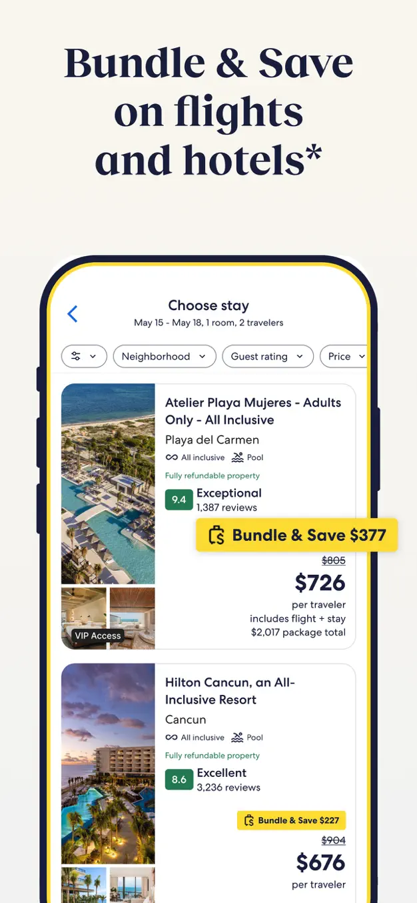
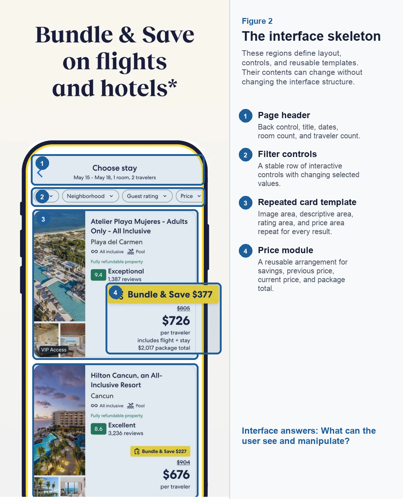
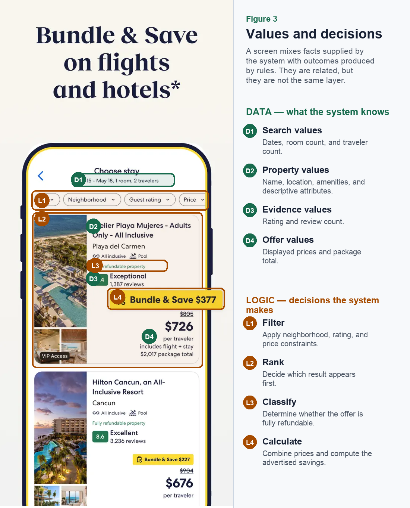
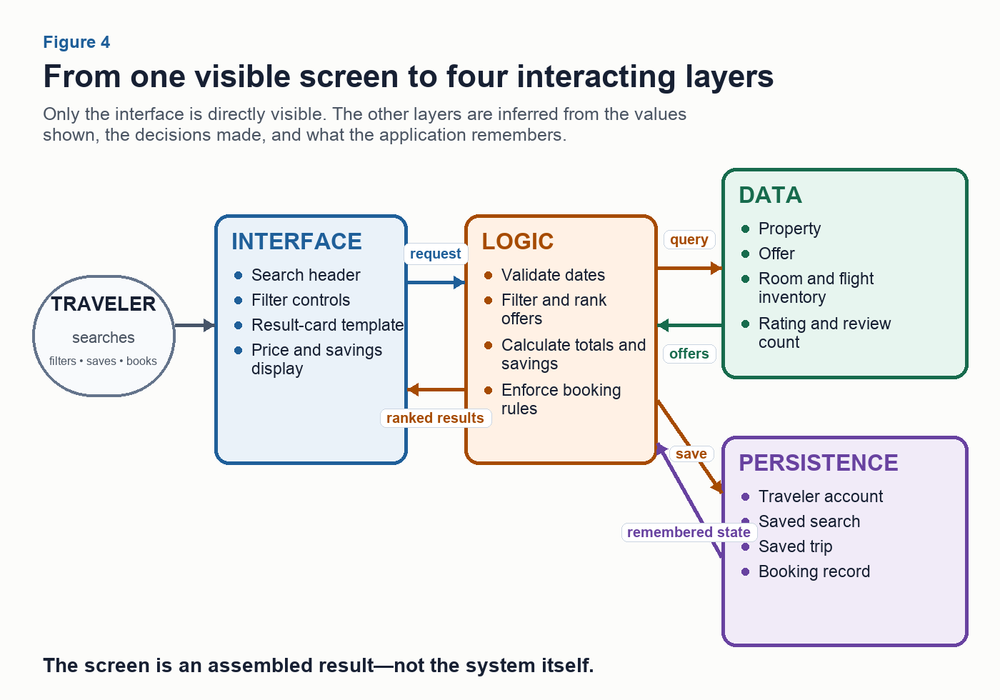

# Assignment 1: Travel Application — CSV Search and SQLite CRUD

> This document is a project reference containing the supplied assignment brief and figures. It records assignment requirements; it does not override repository-level instructions such as `AGENTS.md`.

Adapt the course calculator project into a small local travel application. **Expedia Lite** is a suggested name; students may choose any application name. Use the chosen name consistently in the project folder, interface, and documentation. Each student submits an independently authored project.

Use Vue for the frontend, Python for the backend, and FastAPI for communication between them, with separate `frontend/` and `backend/` folders. A simple, readable interface is sufficient. Use the supplied demo travelers and simulated bookings; the scope is hotel stays, booking, and history.

## Requirements

### Assignment 1 requirements and submission checkpoints

| Checkpoint | Part 1 — CSV Search | Part 2 — SQLite CRUD |
| --- | --- | --- |
| **Due** | Friday, September 11, 2026, at 11:59 PM ET. | Tuesday, September 15, 2026, at 11:59 PM ET. |
| **Application behavior** | Provide a search input for a hotel name and a Search button. Display matching hotels and their available stays from the supplied data in a plain table with clear column labels. Show a clear message when no results match. | Provide search, simulated booking, and booking history. All CRUD actions must be performed through the frontend: create a new booking, read it in history, update its status to cancel it while retaining the record, and delete a test booking. |
| **Data** | The Python backend reads `hotels.csv` and `trips.csv` and connects their records using `hotel_id`. FastAPI returns the matching records to the Vue frontend. | Seed a SQLite database with the supplied hotel, trip, user, and booking records. This is the initial data, not a fixed limit on the application's contents. After seeding, all application reads and writes use SQLite. Frontend actions send requests through FastAPI to the Python backend, which creates, retrieves, updates, and deletes the stored records. Users can add new bookings beyond the seeded examples. Preserve existing IDs and assign unique IDs to new records. |
| **Verification** | Manually scan the changes in VS Code. Check a successful search using a hotel name from the supplied data and a search with no results in the browser. Record expected and observed results. | Manually scan the changes in VS Code. Demonstrate each CRUD action through the frontend, including records added after seeding. Verify that additions, updates, and deletions remain after a browser refresh and restarting the frontend and backend. Starting the app again must preserve saved changes without duplicating or reloading the starter records. |
| **Git checkpoint** | Ask the agent to commit the reviewed work, push it to GitHub, and identify the exact Part 1 commit. | Develop substantial changes on a feature branch. Merge reviewed and checked work into `main`, check the combined app, and push the final commit. Preserve the Part 1 checkpoint. |
| **Submission** | Upload `report.md` to Part 1 — Submission. | Upload the updated `report.md` to Part 2 — Submission. |
| **Project context for both parts** | Keep `README.md` setup/run instructions, project-specific `AGENTS.md`, a brief design note in `docs/`, selected prompts in `prompts/`, and `handoffs/current.md` current. The design note explains frontend, FastAPI, and backend responsibilities. The handoff states what works, what was checked, remaining limitations, and the next task. Keep these files concise and consistent with the submitted commit. | Keep `README.md` setup/run instructions, project-specific `AGENTS.md`, a brief design note in `docs/`, selected prompts in `prompts/`, and `handoffs/current.md` current. The design note explains frontend, FastAPI, and backend responsibilities. The handoff states what works, what was checked, remaining limitations, and the next task. Keep these files concise and consistent with the submitted commit. |

Each part is worth 100 points, with equal weight in the 10% Assignment 1 group. Assessment follows the requirements and verification evidence in this table. The overview is not a separate submission.

Follow **CHECK → TAKE ACTION → VERIFY** when adding dependencies, as practiced in class.

## Report Format

For each part, upload a single file named `report.md`. Write actual Markdown with one level 1 heading (`#`) for the report title and level 2 headings (`##`) for its sections. Use this structure, replacing the bracketed text and the part number:

```markdown
# [Chosen application name] — Part 1

## Repository and commit

[GitHub repository URL and the exact commit submitted for this part.]

## Implementation

[Briefly explain the implemented flow and the responsibilities of the frontend,
FastAPI, and backend. For Part 2, summarize the changes since Part 1.]

## Verification

[Record the manual review and browser checks: action, expected result, and observed result.
Embed or link screenshots stored in the repository using URLs the instructor can access.]

## Project context and next steps

[Link to the README, AGENTS.md, design note, selected prompts, and current handoff.
State any remaining limitations and the next task.]
```

Use **Upload** on the appropriate submission page, attach `report.md`, and select **Submit Assignment**. Keep the report and its screenshots in the repository and ensure that the instructor can access every linked item.

## Sample Data

Download the instructor's sample travel data pack: `hotels.csv`, `trips.csv`, `users.csv`, and `bookings.csv`. A trip is one offered hotel stay with fixed dates. Each trip refers to one hotel through `hotel_id`; each booking refers to a demo traveler through `user_id` and a trip through `trip_id`. Every record also has its own unique ID. Several trips can reference the same hotel, and several bookings can reference the same traveler or trip.

Hotels connect to trips through `hotel_id`. Trips and demo travelers connect to bookings through `trip_id` and `user_id`. Each record has its own unique ID.


*Figure 5. The sample CSV relationships. One hotel can have several offered stays; one traveler can have several bookings. A booking connects a traveler to a trip.*

Extract the ZIP before opening the CSV files in Excel. The included README explains the columns and sample records. Browse individual CSV files and the guide.

## Decomposition Reference

### Explore the Expedia example and the four application layers

Week 1 introduced application decomposition: interface, logic, data, and persistence. Week 2 connected this view to visual references, project organization, manual review, Git, and browser verification.

Use Expedia as an observable reference. Screenshots, annotations, and sketches can help communicate the intended interface. The example illustrates how to reason about an application; it does not require copying every visible feature.

Nearly every application separates into the same four concerns. A visible screen is evidence of those layers, not the whole system. The interface can be observed directly; data, logic, and persistence must be inferred from the values shown, the decisions made, and what the application remembers.

### The four layers behind an application screen

| Layer | The question it answers | How to find it from the outside |
| --- | --- | --- |
| **Data** | What things exist in this system, and what does each know about itself? | Every noun the interface shows is a candidate: property, offer, traveler, booking, and itinerary. |
| **Logic** | What decisions does the system make that the user does not? | Look for anything ranked, filtered, calculated, validated, classified, or refused. Why is this result shown first? |
| **Persistence** | What survives? What is remembered after the tab closes? | Return later or sign in again. What remains was persisted; what disappeared may have existed only in the interface. |
| **Interface** | What does the user see and manipulate? | This is the only layer that can be observed directly. Begin here, then infer what must exist underneath. |

The following figures read one Expedia screen from the outside in.



*Figure 1. The evidence available from outside the application: one rendered results screen. Source: Expedia App Store listing. © Expedia Group.*



*Figure 2. Interface structure: stable regions that organize changing content. Annotation adapted from the Expedia App Store image. © Expedia Group.*



*Figure 3. Data and logic share the screen but answer different questions: what the system knows and what it decides. Annotation adapted from the Expedia App Store image. © Expedia Group.*



*Figure 4. An inferred system view. The screen is an assembled result of four interacting layers, not the system itself.*
